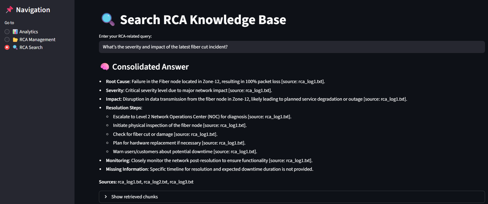
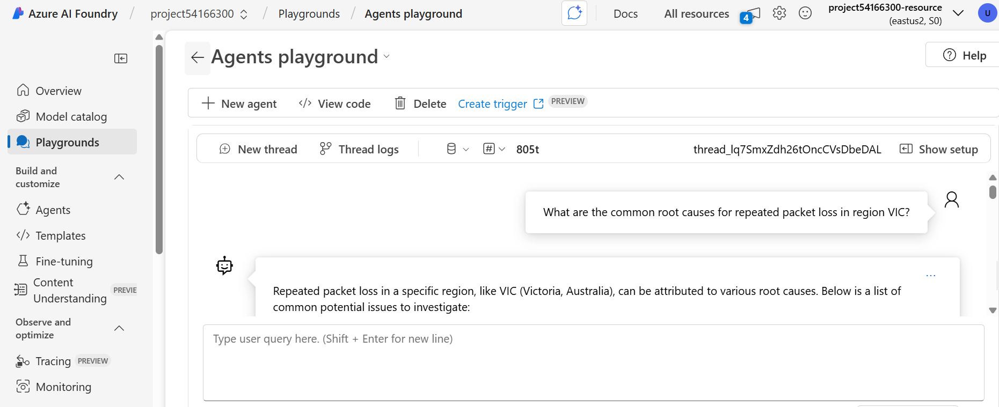
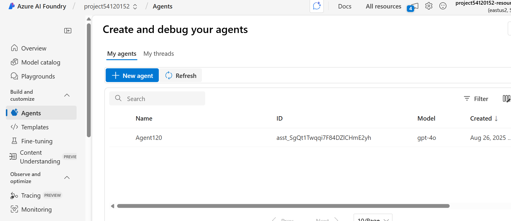
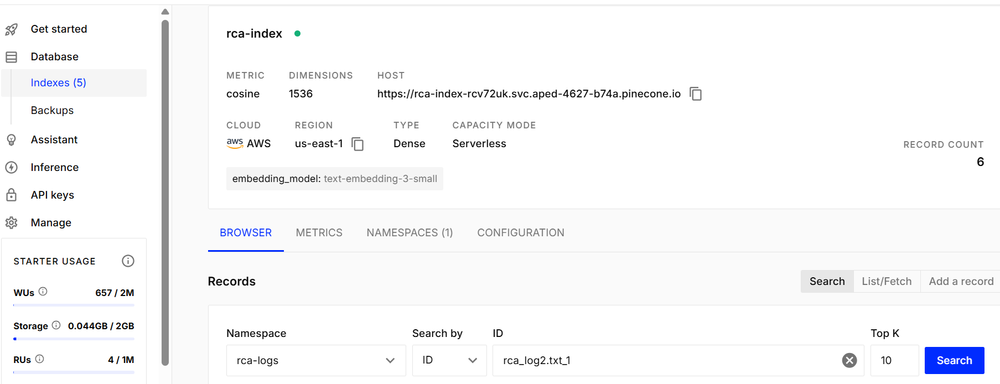
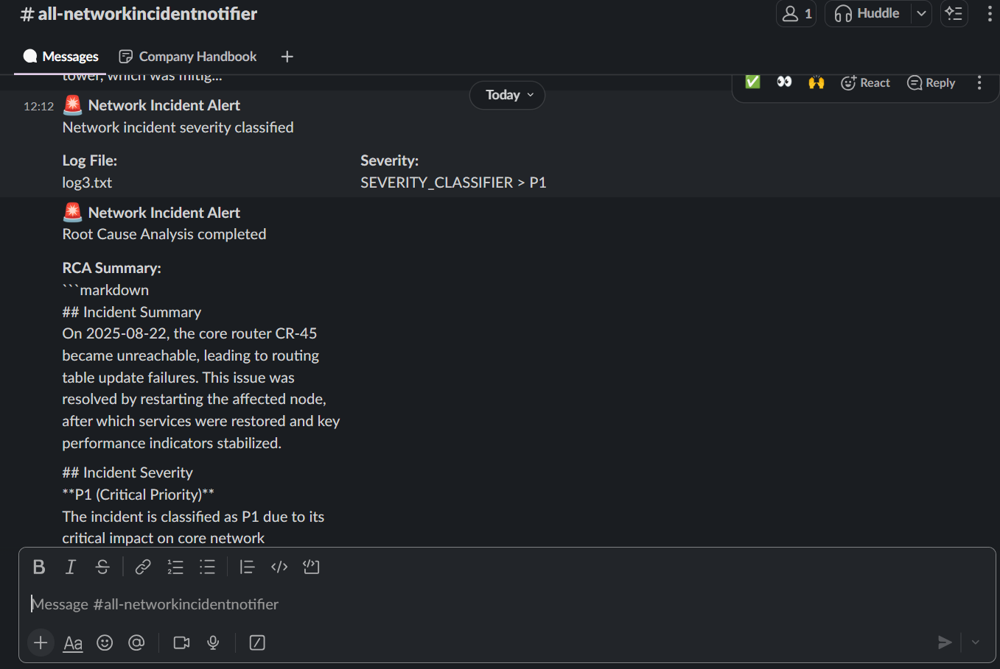

# Automated Network Fault Detection & Root Cause Analysis (RCA) using Generative AI.

A practical system for analyzing telecom/network logs, classifying incident severity, executing simulated corrective actions, generating RCA reports, and surfacing insights via a Streamlit dashboard. It supports:

- **Streamlit UI** for RCA Management, Search (RAG over Pinecone), and Analytics
- **Agent flows** for severity classification and RCA generation
- **Slack notifications** for key incident lifecycle events
- **Pinecone** for semantic search over RCA reports



---
Demo:
https://www.loom.com/share/806f70fae81248b48ebc4ee8b45c6165?sid=e0f2fa0a-ee76-4f46-ac39-0d00a2d5de66


Pinecone & Streamlit Integration:
https://www.loom.com/share/f2ab42430e0648198cc0606d16a33401?sid=a93fd330-724d-468d-abda-d26e72b7090d


---

## 1) Quick Start

- **Python**: 3.10 or newer is recommended
- **OS**: Windows (PowerShell) verified; Linux/macOS should work similarly

```powershell
# Clone
cd C:\Knowledge\GenAI2025
git clone https://github.com/somaazure/Automated-Network-Fault-Detection-Root-Cause-Analysis-RCA-System.git
cd Automated-Network-Fault-Detection-Root-Cause-Analysis-RCA-System

# (Optional) Create and activate venv
python -m venv .venv
.\.venv\Scripts\Activate.ps1

# Install dependencies
pip install -r requirements.txt

# Create an .env file from the example
copy env_example .env
```

Then edit `.env` (see full list in Section 3). At minimum for Streamlit:
- `OPENAI_API_KEY=`
- `PINECONE_API_KEY=`, `PINECONE_INDEX=`, `PINECONE_NAMESPACE=` (index must exist)
- `SLACK_WEBHOOK_URL=` (optional; if not set, Slack is disabled)

Run the Streamlit app:
```powershell
streamlit run app.py
```

User Queries you can try:

** Make sure you run the RCA Management tab first so reports are indexed.

- Severity and impact:
  - What’s the severity and impact of the latest fiber cut incident?
  - List P1 incidents from the past week and their customer impact.
  - Which components were most impacted in the last P2 events?

- Root cause and patterns:
  - What are the common root causes for repeated packet loss in region VIC?
  - Summarize root causes for congestion incidents on weekends.
  - Are there recurring failures linked to BGP flaps in core routers?

- Remediation and prevention:
  - What corrective actions resolved link instability incidents last month?
  - What preventive measures are recommended for repeated backhaul congestion?
  - Provide a runbook summary for mitigating DNS resolution failures.

- Device/site specific:
  - Show incidents involving gNB ID 12345 and their resolutions.
  - Any RCA entries related to router R9 in Melbourne POP?
  - What issues have affected the core link between SYD and MEL?

- Time and trend analysis:
  - Incidents between 02:00–06:00 yesterday with root causes and severity.
  - Compare last 3 outages’ root causes and time-to-recover.
  - Trend of voice quality degradations over the past 30 days.

- Symptom-driven:
  - Possible causes of intermittent high latency on 5G cells in CBD?
  - Why did throughput drop by 60% on the west region backhaul?

- Compliance and SLA:
  - Which incidents risked SLA breaches this quarter?
  - List RCAs that mention emergency field dispatch.

- Knowledge retrieval:
  - Provide known fixes for frequent S1 interface resets.
  - Show RCAs mentioning misconfigured QoS policies and their remediation.

Summary:
- Use the RCA Management tab first to generate/index reports.
- Then paste any of the above into the RCA Search tab to retrieve relevant RCAs with metadata.

---

## 2) What’s Inside

- `app.py`: Streamlit dashboard with three tabs
  - **RCA Management**: processes `logs/` into `rca_reports/`, chunks and indexes in Pinecone
  - **RCA Search**: asks questions over the RCA knowledge base (RAG on Pinecone)
  - **Analytics**: simple charts summarizing RCA content
- `run_agents.py`: lightweight orchestrator using `agents/agent_orchestrator.py` for severity + RCA
- `network_fault_detection.py`: Azure AI multi‑agent flow with Slack notifications and simulated ops
- `storage/`
  - `log_processor.py`: converts raw logs to RCA summaries using OpenAI
  - `rca_vector_store.py`: Pinecone + OpenAI embeddings for indexing/search/answering
  - `analytics_engine.py`: helpers for analytics
- `agents/`
  - `agent_orchestrator.py`: Semantic Kernel setup and agent prompts wiring
  - `prompts.py`: instruction templates for severity and RCA agents
- `utils/slack_notifier.py`: simple Slack webhook notifier
- `logs/`: sample logs to process
- `rca_reports/`: generated RCA files (created at runtime)

Architecture visual cues:









---

## 3) Environment Variables (.env)

Create a `.env` in the project root. The following are used across components:

- OpenAI (used by Streamlit RCA processing and RAG)
  - `OPENAI_API_KEY`

- Pinecone (index must pre-exist in your account)
  - `PINECONE_API_KEY`
  - `PINECONE_INDEX` (e.g., `rca-index`)
  - `PINECONE_NAMESPACE` (e.g., `rca-logs`)

- Slack (optional; used by agents and/or app where applicable)
  - `SLACK_WEBHOOK_URL` (incoming webhook URL)

- Azure OpenAI (required for `agents/agent_orchestrator.py`)
  - `AZURE_OPENAI_ENDPOINT` (e.g., `https://<resource>.openai.azure.com`)
  - `AZURE_OPENAI_API_KEY`
  - `AZURE_OPENAI_DEPLOYMENT_NAME` (your chat model deployment, e.g., `gpt-4o-mini`)
  - `AZURE_OPENAI_API_VERSION` (optional; default `2024-07-01-preview`)

Notes:
- `storage/rca_vector_store.py` expects the Pinecone index to already exist. Create it in the Pinecone console (`https://app.pinecone.io`).
- Missing Slack webhook is OK; notifications will simply be skipped.

---

## 4) Running the Streamlit Dashboard

1) Ensure `.env` is configured (Section 3) and dependencies installed.
2) Place sample logs (provided) in `logs/`.
3) Start the app:
```powershell
streamlit run app.py
```
4) In the sidebar, navigate between:
   - **📂 RCA Management**: Click once; it will:
     - Process new files from `logs/` into `rca_reports/`
     - Chunk and index reports into Pinecone
     - Preview the most recent RCA files
   - **🔍 RCA Search**: Ask questions over indexed RCA content (RAG powered by OpenAI + Pinecone)
   - **📊 Analytics**: View simple counts and charts derived from `rca_reports/`

Tip: If Pinecone is not configured or index missing, the Search tab will show errors/warnings. Configure `.env` and ensure your index exists.

---

## 4.1) Quick Demo Walkthrough

- Open the app and go to `📂 RCA Management` → process logs and index RCAs.
- Switch to `🔍 RCA Search` → ask a question like: "What were the top root causes?"
- Review `📊 Analytics` for simple counts.

Visuals:


## 5) Running the Agent Orchestrator (Simple)

This path uses the Semantic Kernel setup in `agents/agent_orchestrator.py`.

```powershell
python run_agents.py
```
What it does:
- Reads each `*.txt` file in `logs/`
- Classifies severity (SEVERITY_CLASSIFIER)
- Generates an RCA (ROOT_CAUSE_ANALYSIS)
- Saves RCA files to `rca_reports/`
- Sends Slack notifications if configured

Troubleshooting:
- If you see an error about missing Azure OpenAI config, ensure these are set in `.env`:
  - `AZURE_OPENAI_ENDPOINT`, `AZURE_OPENAI_API_KEY`, `AZURE_OPENAI_DEPLOYMENT_NAME`

---

## 6) Running the Azure Multi‑Agent Flow (Advanced)

`network_fault_detection.py` uses Azure AI Agent Service with four agents and Slack notifications. You’ll need:
- Valid Azure OpenAI deployment and access
- Azure credentials on your machine (DefaultAzureCredential). On Windows, authenticate via:
```powershell
az login
```
Run:
```powershell
python network_fault_detection.py
```
Flow overview:
- USER provides the log file path (system iterates `logs/*.txt`)
- `INCIDENT_MANAGER` suggests one action (restart, reroute, QoS, scale, escalate, or no action)
- `NETWORK_OPS_ASSISTANT` executes simulated ops (appends to the same log)
- `SEVERITY_CLASSIFIER` returns P1/P2/P3 and triggers Slack notification
- `ROOT_CAUSE_ANALYSIS` writes a Markdown RCA into `rca_reports/` and signals completion

Common messages you might see:
- Slack enabled/disabled notice based on `SLACK_WEBHOOK_URL`
- Cooling down on API rate limits

---

## 7.1) Docker (Optional)

Run the app in Docker without installing Python locally.

1) Create a `Dockerfile` in the repo root (or copy-paste as needed):

```dockerfile
FROM python:3.10-slim

WORKDIR /app

COPY requirements.txt ./
RUN pip install --no-cache-dir -r requirements.txt

COPY . .

# Streamlit runs on 8501 by default
EXPOSE 8501

CMD ["streamlit", "run", "app.py", "--server.port=8501", "--server.address=0.0.0.0"]
```

2) Build and run:

```bash
docker build -t network-rca:latest .
docker run --env-file .env -p 8501:8501 network-rca:latest
```

3) Open the UI at `http://localhost:8501`.

Notes:
- Mount local folders if you want to persist writes:
  - `-v %cd%/logs:/app/logs -v %cd%/rca_reports:/app/rca_reports` (PowerShell)
- Pinecone and OpenAI keys must be provided via `.env` or `-e` variables.

## 7) Pinecone Setup

- Create an index (e.g., name: `rca-index`, dimension matches OpenAI `text-embedding-3-small`)
- Put the values into `.env`:
  - `PINECONE_API_KEY`
  - `PINECONE_INDEX=rca-index`
  - `PINECONE_NAMESPACE=rca-logs`
- In `RCA Management`, re-run indexing to upsert vectors.


---

## 8) Slack Setup (Optional)

- Create an Incoming Webhook in Slack and copy the URL
- Set `SLACK_WEBHOOK_URL` in `.env`
- You’ll receive notifications for severity classification, actions, and resolution (when applicable)


---

## 9) Testing the End‑to‑End Flow

- Ensure there are `.txt` logs under `logs/` (samples included)
- Path A (UI‑first):
  1. Run Streamlit, open **RCA Management** to generate/index RCAs
  2. Go to **RCA Search** and ask a question; verify sourced snippets
  3. View **Analytics** charts
- Path B (Agents‑first):
  1. Run `python run_agents.py`
  2. Confirm RCA files appear in `rca_reports/`
  3. Start Streamlit and use Search/Analytics on the generated RCAs
- Path C (Azure Multi‑Agent):
  1. `az login` then `python network_fault_detection.py`
  2. Watch console and Slack for status updates

---

## 10) Troubleshooting

- **Pinecone index does not exist**: The app will raise a message. Create it in the Pinecone console and set `PINECONE_INDEX` correctly.
- **OpenAI errors**: Ensure `OPENAI_API_KEY` is valid and you have access to the referenced models.
- **Azure OpenAI missing**: Provide `AZURE_OPENAI_*` in `.env` for agent flows.
- **Slack not configured**: Notifications are skipped; provide `SLACK_WEBHOOK_URL` to enable.
- **No RCA reports in Analytics/Search**: First generate them via **RCA Management** or by running the agents.

---

## 11) Repository Scripts At‑a‑Glance

- `streamlit run app.py` — UI for RCA Management, Search, and Analytics
- `python run_agents.py` — Simple agent pipeline
- `python network_fault_detection.py` — Azure multi‑agent pipeline with Slack

---

## 12) License

MIT (or your preferred license). Update as needed.


